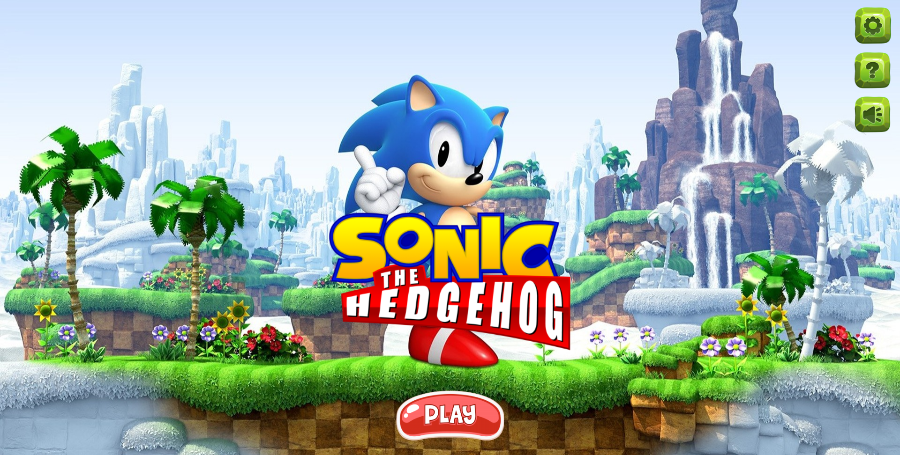
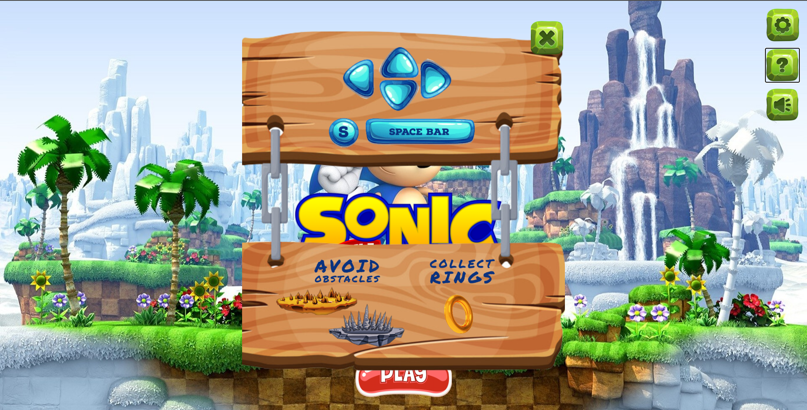
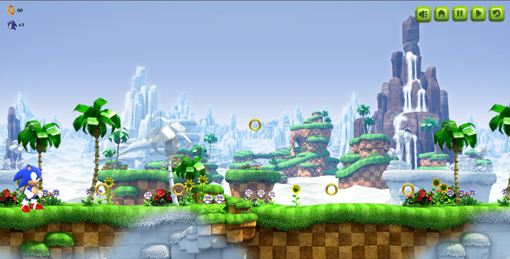
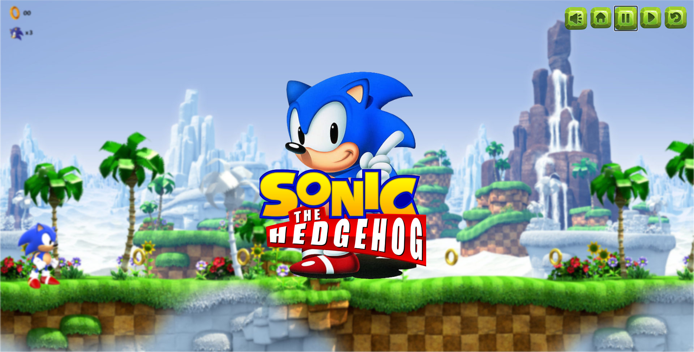
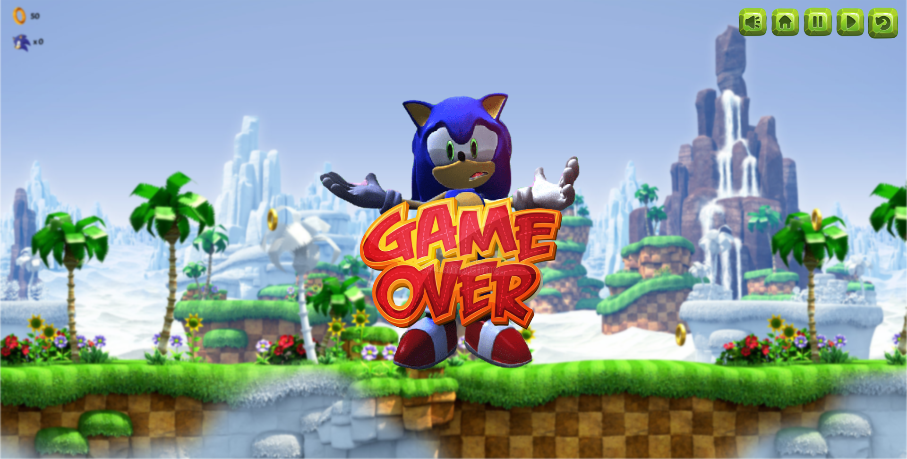
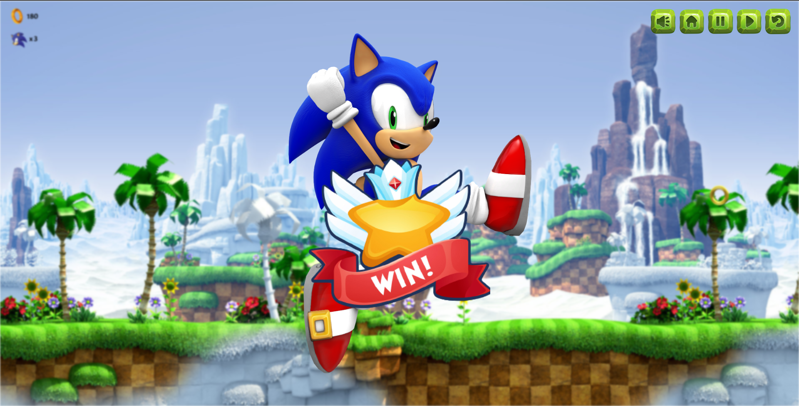

# **SONIC - The Hedgehog**

This is a small game that I developed with JavaScript (using JQuery Library).. 
Hope you'll enjoy it..

#

  
  
  
  
  
  

<!-- <video src = "assets/demo/Sonic-Demo3" data-canonical-src="https://user-images.githubusercontent.com/169707/126715420-991ad821-9ac8-4b66-b79e-e0966e0f3a89.mp4" controls="controls" muted="muted" class="d-block rounded-bottom-2 width-fit" style="max-height:640px;"> -->

 <!-- <video src="https://user-images.githubusercontent.com/169707/126715420-991ad821-9ac8-4b66-b79e-e0966e0f3a89.mp4" data-canonical-src="https://user-images.githubusercontent.com/169707/126715420-991ad821-9ac8-4b66-b79e-e0966e0f3a89.mp4" controls="controls" muted="muted" class="d-block rounded-bottom-2 width-fit" style="max-height:640px;">  -->

 <!-- <video controls="controls" src="assets/demo/Sonic-Demo3"> -->

 <video controls src="assets/demo/Sonic-Demo3">
    <!-- <track src="assets/video/caption.vtt" default kind="captions" srclang="eng"> -->